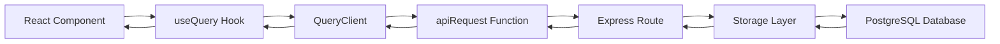

# PhysicianCRM API Technical Documentation

## Overview

This document provides a comprehensive technical reference for how the PhysicianCRM APIs work with frontend selectors. This documentation maps the complete data flow from backend endpoints through TanStack Query to frontend components, providing the information needed to iterate and extend the system.

## Table of Contents

1. [API Architecture](#api-architecture)
2. [Query Client Configuration](#query-client-configuration)
3. [API Endpoints Reference](#api-endpoints-reference)
4. [Frontend Query Patterns](#frontend-query-patterns)
5. [Data Flow Patterns](#data-flow-patterns)
6. [Mutation Patterns](#mutation-patterns)
7. [Error Handling](#error-handling)
8. [Cache Management](#cache-management)
9. [Implementation Examples](#implementation-examples)
10. [Adding New APIs](#adding-new-apis)

---

## API Architecture

### Backend Stack
- **Express.js** server with RESTful API design
- **PostgreSQL** database with Drizzle ORM
- **Zod** schema validation for request/response data
- **JWT-based authentication** with session management
- **Rate limiting** and security middleware
- **Comprehensive error handling** with sanitized responses

### Frontend Stack
- **TanStack Query v5** for server state management
- **Custom apiRequest** function for HTTP requests
- **Automatic cache invalidation** and optimistic updates
- **Real-time data synchronization** with configurable refresh intervals
- **Type-safe** API interactions with TypeScript

---

## Query Client Configuration

### Core Configuration (`src/lib/queryClient.ts`)

```typescript
// API base URL configuration
const API_BASE_URL = import.meta.env.VITE_API_URL || '/api';

// Custom fetch function for all API requests
export async function apiRequest(url: string, options: RequestInit = {}) {
  const fullUrl = url.startsWith('http') ? url : `${API_BASE_URL}${url}`;
  
  const config: RequestInit = {
    headers: {
      'Content-Type': 'application/json',
      ...options.headers,
    },
    credentials: 'include', // Include authentication cookies
    ...options,
  };

  // Handle FormData and JSON body types
  if (options.body) {
    if (options.body instanceof FormData) {
      delete config.headers['Content-Type']; // Let browser set boundary
      config.body = options.body;
    } else if (typeof options.body === 'object') {
      config.body = JSON.stringify(options.body);
    }
  }

  const response = await fetch(fullUrl, config);
  
  if (!response.ok) {
    const errorData = await response.json().catch(() => null);
    throw new Error(errorData?.error || `HTTP ${response.status}: ${response.statusText}`);
  }
  
  return response.status === 204 ? null : response.json();
}

// QueryClient with automatic apiRequest integration
export const queryClient = new QueryClient({
  defaultOptions: {
    queries: {
      queryFn: async ({ queryKey }) => {
        const [url] = queryKey as [string];
        return apiRequest(url);
      },
      staleTime: 5 * 60 * 1000, // 5 minutes
      retry: (failureCount, error) => {
        // Smart retry logic - don't retry 4xx errors except 408, 429
        if (error instanceof Error && error.message.includes('HTTP 4')) {
          const status = parseInt(error.message.match(/HTTP (\d+)/)?.[1] || '0');
          if (status === 408 || status === 429) return failureCount < 3;
          return false;
        }
        return failureCount < 3;
      },
    },
  },
});
```

### Key Features
- **Automatic URL resolution**: Supports both relative and absolute URLs
- **Authentication handling**: Automatically includes auth cookies
- **Smart body handling**: Correctly handles JSON and FormData
- **Intelligent retry logic**: Avoids unnecessary retries on client errors
- **Global error handling**: Consistent error format across the application

---

## API Endpoints Reference

### 🔐 Authentication Endpoints

| Method | Endpoint | Frontend Query Key | Purpose |
|--------|----------|-------------------|---------|
| `POST` | `/api/auth/signup` | N/A (Mutation) | User registration |
| `POST` | `/api/auth/login` | N/A (Mutation) | User login |
| `POST` | `/api/auth/logout` | N/A (Mutation) | User logout |
| `GET` | `/api/auth/me` | `['/api/auth/me']` | Get current user |
| `POST` | `/api/auth/change-password` | N/A (Mutation) | Change password |
| `POST` | `/api/auth/extend-session` | N/A (Mutation) | Extend session |
| `GET` | `/api/auth/activity-log` | `['/api/auth/activity-log']` | User activity log (admin) |

### 👤 Profile Management

| Method | Endpoint | Frontend Query Key | Purpose |
|--------|----------|-------------------|---------|
| `POST` | `/api/profiles` | N/A (Mutation) | Create profile |
| `GET` | `/api/profiles` | `['/api/profiles']` | Get all profiles (paginated) |
| `GET` | `/api/profiles/:id` | `['/api/profiles', id]` | Get specific profile |
| `GET` | `/api/profiles/user/:userId` | `['/api/profiles/user', userId]` | Get profile by user ID |
| `PUT` | `/api/profiles/:id` | N/A (Mutation) | Update profile |
| `DELETE` | `/api/profiles/:id` | N/A (Mutation) | Delete profile |

### 🏥 Practice Management

| Method | Endpoint | Frontend Query Key | Purpose |
|--------|----------|-------------------|---------|
| `POST` | `/api/practices` | N/A (Mutation) | Create practice |
| `GET` | `/api/practices` | `['/api/practices']` | Get all practices |
| `GET` | `/api/practices/:id` | `['/api/practices', id]` | Get specific practice |
| `GET` | `/api/practices/:id/clinicians` | `['/api/practices', id, 'clinicians']` | Get practice physicians |
| `PUT` | `/api/practices/:id` | N/A (Mutation) | Update practice |
| `PUT` | `/api/practices/:id/assign-physicians` | N/A (Mutation) | Bulk assign physicians |
| `PUT` | `/api/practices/:id/unassign-physicians` | N/A (Mutation) | Bulk unassign physicians |

### 👨‍⚕️ Physician Management

| Method | Endpoint | Frontend Query Key | Purpose |
|--------|----------|-------------------|---------|
| `POST` | `/api/physicians` | N/A (Mutation) | Create physician |
| `GET` | `/api/physicians` | `['/api/physicians']` | Get all physicians |
| `GET` | `/api/physicians?search=term` | `['/physicians?search=${encodeURIComponent(term)}']` | Search physicians |
| `GET` | `/physicians/:id` | `['/physicians', id]` | Get specific physician |
| `GET` | `/physicians/:id/full` | `['/physicians', id, 'full']` | Get full physician profile |
| `PUT` | `/physicians/:id` | N/A (Mutation) | Update physician |
| `DELETE` | `/physicians/:id` | N/A (Mutation) | Delete physician |

### 📋 Licensing & Certification

| Method | Endpoint | Frontend Query Key | Purpose |
|--------|----------|-------------------|---------|
| `POST` | `/physicians/:physicianId/licenses` | N/A (Mutation) | Create license |
| `GET` | `/physicians/:physicianId/licenses` | `['/physicians', physicianId, 'licenses']` | Get physician licenses |
| `GET` | `/licenses/expiring/:days` | `['/licenses/expiring', days]` | Get expiring licenses |
| `PUT` | `/licenses/:id` | N/A (Mutation) | Update license |
| `POST` | `/physicians/:physicianId/certifications` | N/A (Mutation) | Create certification |
| `GET` | `/physicians/:physicianId/certifications` | `['/physicians', physicianId, 'certifications']` | Get certifications |

### 📄 Document Management

| Method | Endpoint | Frontend Query Key | Purpose |
|--------|----------|-------------------|---------|
| `POST` | `/physicians/:physicianId/documents` | N/A (Mutation) | Create document record |
| `GET` | `/physicians/:physicianId/documents` | `['/physicians', physicianId, 'documents']` | Get physician documents |
| `GET` | `/documents/:id/download` | N/A (Mutation) | Get download URL |
| `POST` | `/documents/upload` | N/A (Mutation) | Upload document |
| `PUT` | `/documents/:id` | N/A (Mutation) | Update document |
| `DELETE` | `/documents/:id` | N/A (Mutation) | Delete document |

### 📊 Analytics & Reporting

| Method | Endpoint | Frontend Query Key | Purpose |
|--------|----------|-------------------|---------|
| `GET` | `/analytics/physicians/status-summary` | `['/analytics/physicians/status-summary']` | Physician status summary |
| `GET` | `/analytics/licenses/expiration-report` | `['/analytics/licenses/expiration-report', { days: 30 }]` | License expiration report |
| `GET` | `/analytics/certifications/expiration-report` | `['/analytics/certifications/expiration-report', { days: 30 }]` | Certification expiration |
| `GET` | `/analytics/compliance` | `['/analytics/compliance']` | Compliance rates |
| `GET` | `/analytics/renewal-trends` | `['/analytics/renewal-trends']` | Renewal trend data |
| `GET` | `/analytics/expiration-forecast` | `['/analytics/expiration-forecast']` | Expiration forecasts |
| `GET` | `/analytics/provider-metrics` | `['/analytics/provider-metrics']` | Provider metrics |
| `GET` | `/analytics/license-distribution` | `['/analytics/license-distribution']` | License distribution |

### 🔄 Renewal Workflow

| Method | Endpoint | Frontend Query Key | Purpose |
|--------|----------|-------------------|---------|
| `POST` | `/renewal/initiate` | N/A (Mutation) | Start renewal workflow |
| `GET` | `/renewals/statistics` | `['/renewals/statistics']` | Renewal statistics |
| `GET` | `/renewals` | `['/renewals']` | Get upcoming renewals |
| `GET` | `/renewal/:id/timeline` | `['/renewal', id, 'timeline']` | Get renewal timeline |
| `GET` | `/renewal/:id/checklist` | `['/renewal', id, 'checklist']` | Get renewal checklist |
| `PUT` | `/renewal/:id/status` | N/A (Mutation) | Update workflow status |
| `POST` | `/renewal/:id/complete-task` | N/A (Mutation) | Complete checklist task |

### 🔔 Notifications

| Method | Endpoint | Frontend Query Key | Purpose |
|--------|----------|-------------------|---------|
| `GET` | `/api/notifications/upcoming` | `['/api/notifications/upcoming', { days: 30 }]` | Get upcoming notifications |
| `GET` | `/notifications/physician/:id` | `['/notifications/physician', id]` | Get physician notifications |
| `PUT` | `/notifications/:id/mark-read` | N/A (Mutation) | Mark notification as read |
| `POST` | `/notifications/check-expirations` | N/A (Mutation) | Trigger expiration check |

### 💰 Payer Enrollment

| Method | Endpoint | Frontend Query Key | Purpose |
|--------|----------|-------------------|---------|
| `GET` | `/api/payer-enrollments` | `['/api/payer-enrollments']` | Get payer enrollments |
| `GET` | `/api/payer-enrollments/:id` | `['/api/payer-enrollments', id]` | Get specific enrollment |
| `POST` | `/api/payer-enrollments` | N/A (Mutation) | Create enrollment |
| `PUT` | `/api/payer-enrollments/:id` | N/A (Mutation) | Update enrollment |
| `PATCH` | `/api/payer-enrollments/:id/status` | N/A (Mutation) | Update enrollment status |
| `DELETE` | `/api/payer-enrollments/:id` | N/A (Mutation) | Delete enrollment |

---

## Frontend Query Patterns

### 1. Basic Data Fetching

```typescript
// Simple data fetching - PhysiciansPage.tsx
const { data: physiciansData, isLoading, error } = useQuery({
  queryKey: ['/physicians'],
  enabled: true,
  throwOnError: false,
  retry: 1,
});
```

### 2. Search with Debouncing

```typescript
// Search implementation - PhysiciansPage.tsx
const [searchTerm, setSearchTerm] = useState("");
const [debouncedSearch, setDebouncedSearch] = useState("");

useEffect(() => {
  const timer = setTimeout(() => {
    setDebouncedSearch(searchTerm);
  }, 300);
  return () => clearTimeout(timer);
}, [searchTerm]);

const { data: physiciansData, isLoading, error } = useQuery({
  queryKey: debouncedSearch 
    ? [`/physicians?search=${encodeURIComponent(debouncedSearch)}`] 
    : ['/physicians'],
  enabled: true,
});
```

### 3. Real-time Data with Refresh Intervals

```typescript
// Real-time notifications - NotificationBadge.tsx
const { data: notifications = [], isLoading } = useQuery<Notification[]>({
  queryKey: ['/api/notifications/upcoming', { days: 30 }],
  queryFn: () => apiRequest('/api/notifications/upcoming?days=30'),
  refetchInterval: 60000, // Refresh every minute
});
```

### 4. Conditional Queries

```typescript
// Conditional data fetching - Dashboard.tsx
const { data: licenseReport, isLoading: isLoadingLicenses } = useQuery<ExpirationReport>({
  queryKey: ['/analytics/licenses/expiration-report', { days: 30 }],
  queryFn: () => apiRequest('/analytics/licenses/expiration-report?days=30'),
  enabled: !!currentUser, // Only fetch if user is authenticated
});
```

### 5. Hierarchical Query Keys

```typescript
// Physician-specific data - PhysicianProfilePage.tsx
const { data: licenses } = useQuery({
  queryKey: ['/physicians', physicianId, 'licenses'],
  enabled: !!physicianId,
});

const { data: certifications } = useQuery({
  queryKey: ['/physicians', physicianId, 'certifications'],
  enabled: !!physicianId,
});
```

---

## Data Flow Patterns

### 1. Component → Query → API → Database



### 2. Cache Flow Pattern

```typescript
// Example: PracticePage.tsx
const { data: practices } = useQuery({
  queryKey: ['/api/practices'],
  staleTime: 5 * 60 * 1000, // Cache for 5 minutes
});

// Data is served from cache if available and not stale
// If stale or missing, automatically refetches from API
```

### 3. Loading States Pattern

```typescript
// Multi-source loading states - Dashboard.tsx
const { data: statusSummary, isLoading: isLoadingStatus } = useQuery({
  queryKey: ['/analytics/physicians/status-summary'],
});

const { data: licenseReport, isLoading: isLoadingLicenses } = useQuery({
  queryKey: ['/analytics/licenses/expiration-report', { days: 30 }],
});

// Combine loading states for UI
const isLoading = isLoadingStatus || isLoadingLicenses;
```

---

## Mutation Patterns

### 1. Basic Mutation with Cache Invalidation

```typescript
// Create practice - PracticePage.tsx
const createPracticeMutation = useMutation({
  mutationFn: async (practiceData: InsertPractice) => {
    return await apiRequest('/api/practices', {
      method: 'POST',
      body: practiceData,
    });
  },
  onSuccess: () => {
    queryClient.invalidateQueries({ queryKey: ['/api/practices'] });
    toast({ title: "Success", description: "Practice created successfully" });
  },
  onError: (error: any) => {
    toast({ title: "Error", description: error.message, variant: "destructive" });
  },
});
```

### 2. Optimistic Updates

```typescript
// Mark notification as read - NotificationBadge.tsx
const markAsReadMutation = useMutation({
  mutationFn: async (notificationId: string) => {
    return await apiRequest(`/notifications/${notificationId}/mark-read`, {
      method: 'PUT',
    });
  },
  onMutate: async (notificationId) => {
    // Cancel outgoing refetches
    await queryClient.cancelQueries({ queryKey: ['/api/notifications/upcoming'] });
    
    // Snapshot previous value
    const previousNotifications = queryClient.getQueryData(['/api/notifications/upcoming']);
    
    // Optimistically update cache
    queryClient.setQueryData(['/api/notifications/upcoming'], (old: any) => 
      old?.map((n: any) => 
        n.id === notificationId ? { ...n, sentStatus: 'read' } : n
      )
    );
    
    return { previousNotifications };
  },
  onError: (err, notificationId, context) => {
    // Rollback on error
    queryClient.setQueryData(['/api/notifications/upcoming'], context?.previousNotifications);
  },
  onSettled: () => {
    // Always refetch after error or success
    queryClient.invalidateQueries({ queryKey: ['/api/notifications/upcoming'] });
  },
});
```

### 3. Bulk Operations

```typescript
// Bulk assign physicians - PracticePage.tsx
const bulkAssignMutation = useMutation({
  mutationFn: async ({ practiceId, physicianIds }: { practiceId: string; physicianIds: string[] }) => {
    return await apiRequest(`/api/practices/${practiceId}/assign-physicians`, {
      method: 'PUT',
      body: { physicianIds },
    });
  },
  onSuccess: () => {
    // Invalidate multiple related queries
    queryClient.invalidateQueries({ queryKey: ['/api/practices'] });
    queryClient.invalidateQueries({ queryKey: ['/physicians'] });
    queryClient.invalidateQueries({ queryKey: ['/api/practices', practiceId, 'clinicians'] });
  },
});
```

### 4. File Upload Mutations

```typescript
// Document upload - DocumentUploader.tsx
const uploadMutation = useMutation({
  mutationFn: async (uploadData: { file: File; physicianId: string; documentType: string }) => {
    const formData = new FormData();
    formData.append('file', uploadData.file);
    formData.append('documentType', uploadData.documentType);
    
    return await apiRequest(`/physicians/${uploadData.physicianId}/documents`, {
      method: 'POST',
      body: formData, // apiRequest handles FormData automatically
    });
  },
  onSuccess: (data, variables) => {
    queryClient.invalidateQueries({ 
      queryKey: ['/physicians', variables.physicianId, 'documents'] 
    });
  },
});
```

---

## Error Handling

### 1. Global Error Handling

```typescript
// QueryClient configuration with global error handling
export const queryClient = new QueryClient({
  defaultOptions: {
    mutations: {
      onError: (error) => {
        console.error('Mutation error:', error);
        // Global error logging could be added here
      },
    },
  },
});
```

### 2. Component-Level Error Handling

```typescript
// Error display in components - PhysiciansPage.tsx
const { data, isLoading, error } = useQuery({
  queryKey: ['/physicians'],
  throwOnError: false, // Handle errors manually
  retry: 1,
});

if (error) {
  return (
    <Alert variant="destructive">
      <AlertCircle className="h-4 w-4" />
      <AlertDescription>
        Failed to load physicians: {error instanceof Error ? error.message : 'Unknown error'}
      </AlertDescription>
    </Alert>
  );
}
```

### 3. Mutation Error Recovery

```typescript
// Error handling with retry - PayerEnrollmentsPage.tsx
const createMutation = useMutation({
  mutationFn: async (data) => apiRequest('/api/payer-enrollments', { method: 'POST', body: data }),
  onError: (error: any) => {
    if (error.message.includes('HTTP 409')) {
      toast({ 
        title: "Duplicate Entry", 
        description: "This enrollment already exists",
        variant: "destructive" 
      });
    } else {
      toast({ 
        title: "Error", 
        description: "Failed to create enrollment. Please try again.",
        variant: "destructive" 
      });
    }
  },
  retry: (failureCount, error) => {
    // Retry network errors but not validation errors
    return !error.message.includes('HTTP 4') && failureCount < 2;
  },
});
```

---

## Cache Management

### 1. Query Key Structure

```typescript
// Hierarchical cache organization
const queryKeys = {
  // Entity-based keys
  physicians: {
    all: ['/physicians'] as const,
    byId: (id: string) => ['/physicians', id] as const,
    licenses: (id: string) => ['/physicians', id, 'licenses'] as const,
    documents: (id: string) => ['/physicians', id, 'documents'] as const,
  },
  practices: {
    all: ['/api/practices'] as const,
    byId: (id: string) => ['/api/practices', id] as const,
    clinicians: (id: string) => ['/api/practices', id, 'clinicians'] as const,
  },
  analytics: {
    status: ['/analytics/physicians/status-summary'] as const,
    licenses: (days: number) => ['/analytics/licenses/expiration-report', { days }] as const,
  }
};
```

### 2. Strategic Cache Invalidation

```typescript
// Targeted cache invalidation after mutations
const updatePhysicianMutation = useMutation({
  mutationFn: async ({ id, data }) => apiRequest(`/physicians/${id}`, { method: 'PUT', body: data }),
  onSuccess: (data, { id }) => {
    // Invalidate specific physician
    queryClient.invalidateQueries({ queryKey: ['/physicians', id] });
    // Invalidate physician list
    queryClient.invalidateQueries({ queryKey: ['/physicians'] });
    // Invalidate related analytics
    queryClient.invalidateQueries({ queryKey: ['/analytics/physicians/status-summary'] });
  },
});
```

### 3. Background Refetching

```typescript
// Automatic background updates - RenewalDashboard.tsx
const { data: renewalStats } = useQuery({
  queryKey: ['/renewals/statistics'],
  refetchInterval: 5 * 60 * 1000, // Refetch every 5 minutes
  refetchIntervalInBackground: true, // Continue refetching when tab is not active
  staleTime: 2 * 60 * 1000, // Consider data stale after 2 minutes
});
```

---

## Implementation Examples

### 1. Dashboard Statistics Component

```typescript
// Dashboard.tsx - Real-time analytics display
export default function Dashboard() {
  // Multiple parallel queries for dashboard metrics
  const { data: statusSummary, isLoading: isLoadingStatus } = useQuery<PhysicianStatusSummary>({
    queryKey: ['/analytics/physicians/status-summary'],
  });

  const { data: licenseReport, isLoading: isLoadingLicenses } = useQuery<ExpirationReport>({
    queryKey: ['/analytics/licenses/expiration-report', { days: 30 }],
    queryFn: () => apiRequest('/analytics/licenses/expiration-report?days=30'),
  });

  const { data: certificationReport, isLoading: isLoadingCertifications } = useQuery<ExpirationReport>({
    queryKey: ['/analytics/certifications/expiration-report', { days: 30 }],
    queryFn: () => apiRequest('/analytics/certifications/expiration-report?days=30'),
  });

  // Combine data from multiple sources
  const stats = [
    {
      title: "Total Physicians",
      value: statusSummary?.total?.toString() || "0",
      isLoading: isLoadingStatus,
      href: "/physicians",
    },
    {
      title: "Expiring Soon",
      value: (
        (licenseReport?.expiringWithinDays || 0) + 
        (certificationReport?.expiringWithinDays || 0)
      ).toString(),
      isLoading: isLoadingLicenses || isLoadingCertifications,
      href: "/renewal-workflows",
    }
  ];

  return (
    <div className="grid gap-4 md:grid-cols-2 lg:grid-cols-4">
      {stats.map((stat, index) => (
        <StatCard key={index} {...stat} />
      ))}
    </div>
  );
}
```

### 2. Search and Filter Component

```typescript
// PhysiciansPage.tsx - Advanced search with debouncing
export default function PhysiciansPage() {
  const [searchTerm, setSearchTerm] = useState("");
  const [debouncedSearch, setDebouncedSearch] = useState("");

  // Debounce search input
  useEffect(() => {
    const timer = setTimeout(() => {
      setDebouncedSearch(searchTerm);
    }, 300);
    return () => clearTimeout(timer);
  }, [searchTerm]);

  // Dynamic query based on search term
  const { data: physiciansData, isLoading, error } = useQuery({
    queryKey: debouncedSearch 
      ? [`/physicians?search=${encodeURIComponent(debouncedSearch)}`] 
      : ['/physicians'],
    enabled: true,
    throwOnError: false,
    retry: 1,
  });

  const physicians = physiciansData?.data || [];

  return (
    <div>
      <Input
        placeholder="Search physicians..."
        value={searchTerm}
        onChange={(e) => setSearchTerm(e.target.value)}
        className="max-w-sm"
      />
      
      {isLoading && <PhysicianSkeleton />}
      {error && <ErrorAlert error={error} />}
      {physicians.length > 0 && <PhysicianTable physicians={physicians} />}
    </div>
  );
}
```

### 3. Form with Mutation

```typescript
// NewPhysicianPage.tsx - Form submission with mutation
export default function NewPhysicianPage() {
  const form = useForm<InsertPhysician>({
    resolver: zodResolver(insertPhysicianSchema),
    defaultValues: {
      fullLegalName: "",
      npi: "",
      emailAddress: "",
      status: "pending",
      providerRole: "physician",
    },
  });

  const createMutation = useMutation({
    mutationFn: async (data: InsertPhysician) => {
      return await apiRequest('/api/physicians', {
        method: 'POST',
        body: data,
      });
    },
    onSuccess: (result) => {
      // Invalidate physicians list
      queryClient.invalidateQueries({ queryKey: ['/physicians'] });
      // Navigate to new physician profile
      setLocation(`/physicians/${result.id}`);
      toast({
        title: "Success",
        description: "Physician profile created successfully",
      });
    },
    onError: (error: any) => {
      toast({
        title: "Error",
        description: error.message,
        variant: "destructive",
      });
    },
  });

  const onSubmit = (data: InsertPhysician) => {
    createMutation.mutate(data);
  };

  return (
    <Form {...form}>
      <form onSubmit={form.handleSubmit(onSubmit)} className="space-y-6">
        <FormField
          control={form.control}
          name="fullLegalName"
          render={({ field }) => (
            <FormItem>
              <FormLabel>Full Legal Name</FormLabel>
              <FormControl>
                <Input {...field} placeholder="Dr. John Smith" />
              </FormControl>
              <FormMessage />
            </FormItem>
          )}
        />
        
        <Button 
          type="submit" 
          disabled={createMutation.isPending}
          className="w-full"
        >
          {createMutation.isPending && <Loader2 className="mr-2 h-4 w-4 animate-spin" />}
          Create Physician Profile
        </Button>
      </form>
    </Form>
  );
}
```

---

## Adding New APIs

### 1. Backend Implementation Steps

#### Step 1: Add Route Handler
```typescript
// server/routes.ts
router.get('/api/new-endpoint', authMiddleware, asyncHandler(async (req: any, res: any) => {
  try {
    const result = await storage.getNewData();
    res.json(result);
  } catch (error) {
    console.error('Error fetching new data:', error);
    res.status(500).json({ error: 'Failed to fetch new data' });
  }
}));
```

#### Step 2: Add Storage Method
```typescript
// server/storage.ts
export interface IStorage {
  // Add new method to interface
  getNewData(): Promise<NewDataType[]>;
}

// Add implementation in PostgreSQLStorage class
async getNewData(): Promise<NewDataType[]> {
  return await this.db.select().from(newDataTable);
}
```

#### Step 3: Add Schema Definition
```typescript
// shared/schema.ts
export const newDataTable = pgTable('new_data', {
  id: uuid('id').primaryKey().defaultRandom(),
  name: text('name').notNull(),
  createdAt: timestamp('created_at').defaultNow(),
});

export const insertNewDataSchema = createInsertSchema(newDataTable);
export const selectNewDataSchema = createSelectSchema(newDataTable);
export type InsertNewData = z.infer<typeof insertNewDataSchema>;
export type SelectNewData = z.infer<typeof selectNewDataSchema>;
```

### 2. Frontend Implementation Steps

#### Step 1: Create Query Hook
```typescript
// src/hooks/useNewData.ts
import { useQuery, useMutation } from '@tanstack/react-query';
import { apiRequest, queryClient } from '@/lib/queryClient';
import type { SelectNewData, InsertNewData } from '../../shared/schema';

export function useNewData() {
  return useQuery<SelectNewData[]>({
    queryKey: ['/api/new-endpoint'],
    staleTime: 5 * 60 * 1000, // 5 minutes
  });
}

export function useCreateNewData() {
  return useMutation({
    mutationFn: async (data: InsertNewData) => {
      return await apiRequest('/api/new-endpoint', {
        method: 'POST',
        body: data,
      });
    },
    onSuccess: () => {
      queryClient.invalidateQueries({ queryKey: ['/api/new-endpoint'] });
    },
  });
}
```

#### Step 2: Use in Component
```typescript
// src/pages/NewDataPage.tsx
import { useNewData, useCreateNewData } from '@/hooks/useNewData';

export default function NewDataPage() {
  const { data: newData, isLoading, error } = useNewData();
  const createMutation = useCreateNewData();

  if (isLoading) return <div>Loading...</div>;
  if (error) return <div>Error: {error.message}</div>;

  return (
    <div>
      {newData?.map(item => (
        <div key={item.id}>{item.name}</div>
      ))}
    </div>
  );
}
```

### 3. Testing New API

#### Backend Testing
```bash
# Test API endpoint directly
curl -X GET "http://localhost:5000/api/new-endpoint" \
  -H "Content-Type: application/json" \
  -b cookies.txt

# Test with authentication
curl -X POST "http://localhost:5000/api/new-endpoint" \
  -H "Content-Type: application/json" \
  -d '{"name": "Test Data"}' \
  -b cookies.txt
```

#### Frontend Testing
```typescript
// Check query in browser dev tools
queryClient.getQueryData(['/api/new-endpoint']);

// Force refetch
queryClient.invalidateQueries({ queryKey: ['/api/new-endpoint'] });

// Check cache state
queryClient.getQueryState(['/api/new-endpoint']);
```

---

## Best Practices

### 1. Query Key Naming Conventions
- Use **consistent patterns**: `['/api/resource']` for collections
- Include **parameters** in query keys: `['/api/resource', { filter: 'active' }]`
- Use **hierarchical structure**: `['/api/users', userId, 'posts']`
- Keep keys **serializable** and **predictable**

### 2. Cache Invalidation Strategy
- **Invalidate specific entities** after mutations affecting them
- **Invalidate parent collections** when child entities change
- **Use query patterns** for bulk invalidation: `{ queryKey: ['/api/users'] }`
- **Combine optimistic updates** with eventual invalidation

### 3. Error Handling Guidelines
- **Provide meaningful error messages** to users
- **Log detailed errors** for debugging
- **Implement retry logic** for transient failures
- **Handle different error types** appropriately (validation, network, server)

### 4. Performance Optimization
- **Use staleTime** to reduce unnecessary refetches
- **Implement pagination** for large datasets
- **Batch related queries** when possible
- **Use background refetching** for real-time data

### 5. Type Safety
- **Define TypeScript interfaces** for all API responses
- **Use Zod schemas** for runtime validation
- **Generate types** from database schema when possible
- **Validate data** at API boundaries

---

## Troubleshooting Guide

### Common Issues and Solutions

#### 1. Query Not Updating
**Problem**: Data doesn't update after mutation
**Solution**: Check cache invalidation
```typescript
// Ensure proper invalidation
queryClient.invalidateQueries({ queryKey: ['/api/resource'] });
```

#### 2. Authentication Errors
**Problem**: 401/403 errors on API calls
**Solution**: Verify auth middleware and credentials
```typescript
// Check if credentials are included
const config = {
  credentials: 'include' as const,
  // ...other options
};
```

#### 3. Stale Data Issues
**Problem**: Old data showing despite updates
**Solution**: Adjust staleTime and refetch settings
```typescript
const { data } = useQuery({
  queryKey: ['/api/resource'],
  staleTime: 0, // Always refetch
  cacheTime: 5 * 60 * 1000, // Keep in cache for 5 minutes
});
```

#### 4. Network Errors
**Problem**: Requests failing due to network issues
**Solution**: Implement proper retry logic
```typescript
const { data } = useQuery({
  queryKey: ['/api/resource'],
  retry: (failureCount, error) => {
    // Custom retry logic
    return failureCount < 3 && !error.message.includes('HTTP 4');
  },
});
```

---

This technical documentation provides a comprehensive reference for understanding and extending the PhysicianCRM API integration. Use this document as a guide when implementing new features, debugging issues, or onboarding new team members to the codebase.